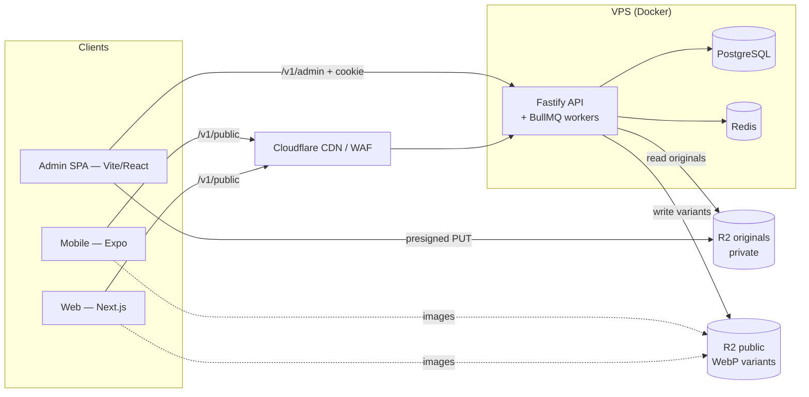

# Technical documentation

How the platform is built, how to run it, and how to keep it healthy. The product spec (what we build and why) is [`../PRD.md`](../PRD.md); agent rules are in [`../../CLAUDE.md`](../../CLAUDE.md).

## Start here

| Page | Read it when |
|---|---|
| [Getting started](getting-started.md) | Setting up a machine or running the stack for the first time |
| [Operations](operations.md) | Running migrations, seeding, creating admins, updating dependencies, deploying |

### Projects

| Project | Status | Page |
|---|---|---|
| `apps/api` — Fastify API + BullMQ workers | **Built** | [projects/api.md](projects/api.md) |
| `packages/shared` — Zod contracts, content renderer, translit, API client | **Built** | [projects/shared.md](projects/shared.md) |
| `apps/admin` — newsroom SPA (React + Vite + shadcn/ui) | **Built** (article editor, political data screens, homepage editor; organizations and users screens pending) | [projects/admin.md](projects/admin.md) |
| `apps/web` — public site (Next.js) | **Built**: design system, homepage, article, person and section pages (party, tag, bill and search pages pending) | [projects/web.md](projects/web.md) |
| `apps/mobile` — app (Expo) | Scaffold | [projects/mobile.md](projects/mobile.md) |

### Features

| Feature | Page |
|---|---|
| Database: schema, migrations, seed | [features/database.md](features/database.md) |
| Admin authentication, sessions, CSRF, roles | [features/auth.md](features/auth.md) |
| Articles: workflow, revisions, autosave, conflicts, links, embeds, sanitized HTML | [features/articles.md](features/articles.md) |
| Background jobs (BullMQ) | [features/jobs.md](features/jobs.md) |
| Political data: admin CRUD and screens, promise history, vote entry, audit log, bulk imports | [features/political-data.md](features/political-data.md) |
| Public read API and caching | [features/public-api.md](features/public-api.md) |
| Media: uploads, WebP variants, library | [features/media.md](features/media.md) |
| Homepage layout: editor curation, versions, public endpoint | [features/homepage.md](features/homepage.md) |
| Web design system: fonts, tokens, themes, components, /styleguide | [features/design-system.md](features/design-system.md) |
| Public site: homepage, article, person and section pages, tag revalidation, SEO, JSON-LD | [features/public-site.md](features/public-site.md) |

## Architecture



- **One API** serves both the cacheable public reads (`/v1/public/*`) and the authenticated newsroom (`/v1/admin/*`). Workers for scheduled publishing, revalidation and image processing run in the same process (flag `WORKERS_ENABLED`).
- **The web caches API reads by tag** (`article:{id}`, `person:{id}`, `homepage`…); after a publish or data edit the API's revalidate job POSTs those tags to the web's `/api/revalidate` ([public-site](features/public-site.md)).
- **Contracts live in `packages/shared`**: every request/response is a Zod schema used by the API (validation + OpenAPI) and by every client (typed fetch client).
- **Postgres is the source of truth**; Redis holds rate-limit counters and BullMQ queues; R2 holds media.

## Repo map

```
apps/api/            Fastify API, Drizzle schema + migrations, BullMQ jobs, CLIs
apps/admin/          Newsroom SPA (article editor, political data, homepage)
apps/web/            Public Next.js site (homepage, article and person pages, styleguide)
apps/mobile/         Expo app (scaffold)
packages/shared/     Zod schemas, content renderer, translit, API client
docker/              Postgres init SQL, SeaweedFS S3 config
docker-compose.yml   Local Postgres, Redis, SeaweedFS (S3)
docs/PRD.md          Product spec
docs/technical/      This documentation
```

## Page template

Every page uses the same sections, in this order. Keep a section with "n/a" rather than deleting it, so gaps stay visible.

1. **Overview** — what it is and its status (built / scaffold / placeholder).
2. **How it works** — the flow; a diagram when it helps.
3. **Tech used** — libraries/versions and why.
4. **How to start** — run, test and use it locally.
5. **How to maintain** — adding to it, migrations, updates, which tests to touch.
6. **Notables** — gotchas, decisions and their reasons, limits, follow-ups.
7. **Key files** — paths into the code.

End each page with `Last updated: YYYY-MM-DD — <what changed>`.

## Keeping these docs current

Any change that affects behaviour, setup, env vars, routes, schema, jobs, dependencies or a gotcha updates the matching page **in the same change** (see the Documentation section of `CLAUDE.md`). New project or feature → new page from the template, linked above. Describe what **is**; plans belong in the PRD or under "Notables → follow-ups".

---
Last updated: 2026-10-08 — section pages in the web status and public site entries. Earlier (2026-10-07): public site page; web status; tag revalidation in the architecture notes.
