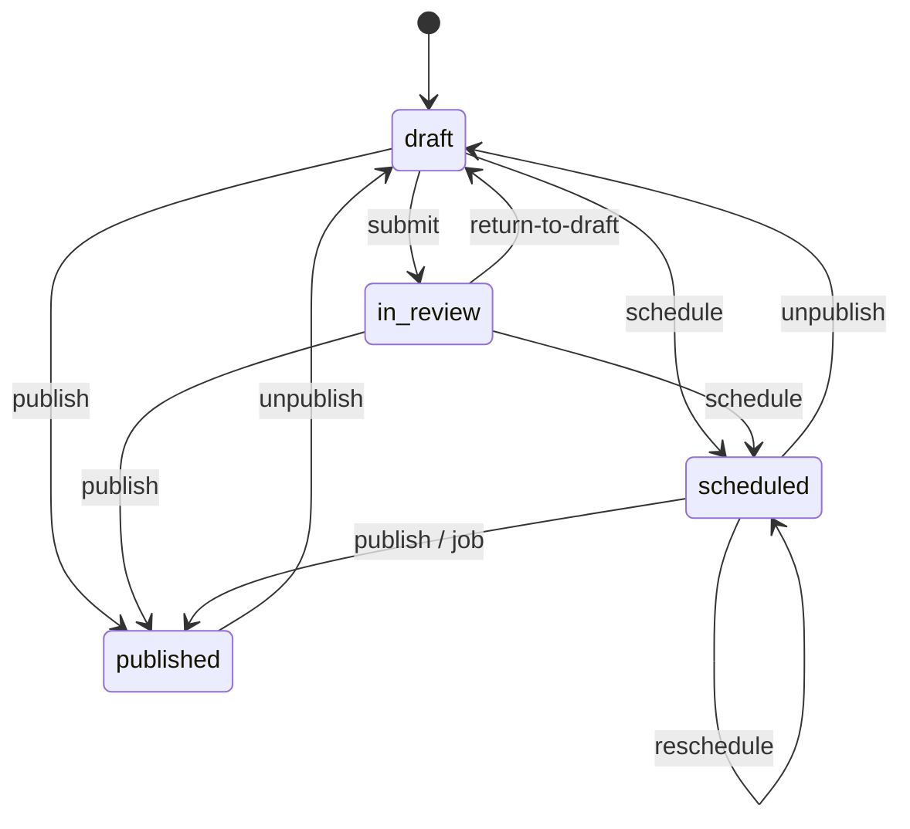

# Articles

## Overview

**Built (API + admin editor).** Newsroom article management covers:

- CRUD and an editorial state machine with role rules
- revisions with diff and restore, including autosave revisions
- corrections on published edits
- links to tags, persons, organizations and bills
- edit-conflict detection
- server-side sanitized HTML
- scheduled publishing

The admin has a Tiptap editor for all of it ([admin](../projects/admin.md#article-editor)).

## How it works

### Routes

`/v1/admin/articles`:

- `GET /` (filters `status`, `authorId`, `categoryId`, `search` on title; paginated, newest-updated first)
- `GET /:id` · `POST /` · `PATCH /:id`
- `POST /:id/submit` · `POST /:id/return-to-draft` · `POST /:id/publish` · `POST /:id/schedule {scheduledAt}` · `POST /:id/unpublish`
- `GET /:id/revisions` · `POST /:id/revisions/:revisionId/restore`

Editor helpers:

- `GET /v1/admin/lookup/{persons,organizations,bills,categories,tags}?search=&ids=&limit=` — every newsroom role. Returns `{ id, label, sublabel, imageUrl }`:
  - persons: label "Б.Нэр", sublabel = current party short name, imageUrl = smallest ready photo variant
  - organizations: sublabel = short name, imageUrl = logo
  - bills: sublabel = registration number
  - `ids=3,17` hydrates selected items and ignores `search`
  - soft-deleted persons and organizations are left out
  - search is ILIKE on the Mongolian/English names and the Latin slug
- `POST /v1/admin/tags {nameMn, nameEn?}` — editor, admin. Slug from `nameEn ?? nameMn`, made unique. The same Mongolian name (case-insensitive) → 409 `DUPLICATE`. Audited.

### Permissions (`@news/shared/policies`)

The same `can()` / `TRANSITIONS` drive API enforcement and the admin's workflow buttons. `apps/api/src/modules/articles/policy.ts` re-exports it.

| Action | reporter | editor | admin | data_editor |
|---|---|---|---|---|
| list, get, revisions | ✓ (all, read-only) | ✓ | ✓ | ✗ |
| create (author = self) | ✓ | ✓ | ✓ | ✗ |
| update, restore | own **and** draft | ✓ | ✓ | ✗ |
| submit | own draft | ✓ | ✓ | ✗ |
| return-to-draft, publish, schedule, unpublish | ✗ | ✓ | ✓ | ✗ |

### State machine

- Any other transition → 409 `INVALID_STATUS_TRANSITION`.
- `archived` exists in the enum but is unused.
- Publish and schedule require non-empty text.
- Republishing keeps the original `published_at`.
- Unpublishing keeps `published_at`, so the public site can answer 410.

### Links (tags, persons, organizations, bills)

- `tagIds`, `personIds`, `organizationIds` and `billIds` are optional on create and update. Each sent array **replaces** that set (at most 50, no duplicates); an omitted array is left alone.
- An unknown id, or a soft-deleted person or organization → 400 `REFERENCE_NOT_FOUND`, and nothing is written.
- `GET /:id` and every write response return the four arrays (sorted).
- Revision snapshots include them, so restore brings links back. Older snapshots have none, so restoring one leaves links unchanged.
- Code: `modules/articles/links.ts`.

### Saving: autosave and conflicts

- **`expectedUpdatedAt`** (optional on `PATCH`): the `updatedAt` the client last saw. If someone saved in between → 409 `EDIT_CONFLICT`. Every update bumps `updated_at`, including links-only changes.
- **`autosave: true`** (optional on `PATCH`): background saves from the editor.
  - Allowed only for `draft` and `in_review`; anything else → 400 `VALIDATION_ERROR`.
  - Writes a revision of kind `autosave`. **Coalescing:** if the latest revision is an `autosave` by the same user and less than 5 minutes old, its snapshot is updated in place, so the history gets at most one autosave row per 5 minutes per editing streak.
  - Manual saves write `update` revisions.
- The admin autosaves every 15 s, sends `expectedUpdatedAt` on every save, and stops autosaving on a 409 until the user reloads.

### Revisions and corrections

- Every create, save and transition writes an `article_revisions` row with a full snapshot (content fields, links, status, dates). `kind` is one of: create, update, autosave, restore, submit, return_to_draft, publish, schedule, unpublish.
- Restore copies content fields (title, slug, lede, body, category, cover, breaking) and links from a snapshot through the same rules as update. It never copies the status.
- Editing a **published** article requires `edit: { type: 'minor' }` or `{ type: 'substantive', correction: { description, reason } }`; missing → 400 `CORRECTION_REQUIRED`. Substantive edits insert a public `corrections` row in the same transaction.

### Content → HTML

1. **Validation.** `bodyJson` (Tiptap/ProseMirror) is validated by `contentDocSchema`, an **allowlist**:
   - nodes: `paragraph`, `heading` (h2–h4), lists, `blockquote`, `horizontalRule`, `hardBreak`
   - `image`: https only; optional `mediaId`, `caption`, `credit`
   - `embed`: `{provider, url}`, YouTube or Facebook only, checked by `parseEmbedUrl`
   - `pullQuote`: inline content plus an optional `attribution`
   - marks: `bold`, `italic`, `underline`, `strike`, `code`, `link` (http/https/mailto)

   Unknown nodes or marks → 400; unknown attributes are stripped. Nesting is capped at 32 levels before parsing.
2. **Rendering.** `renderHtml` builds HTML from known nodes only and escapes all text and attributes:
   - An image with a caption or credit renders as `<figure class="image"><figcaption>… …</figcaption></figure>`.
   - An embed renders as `<figure class="embed embed-youtube|embed-facebook"><iframe src=…>`. The iframe `src` is **always derived** from the parsed URL: `https://www.youtube-nocookie.com/embed/<id>` or `https://www.facebook.com/plugins/{post,video}.php?href=…`.
   - A pull quote renders as `<figure class="pull-quote"><blockquote>
…
</blockquote><figcaption>…</figcaption></figure>`.
3. **Sanitizing.** `sanitize-html` (`lib/html.ts`) re-applies the allowlist as a second layer:
   - tags, plus classes for `figure`/`span`
   - iframe attributes with fixed values
   - `allowedIframeHostnames`, https only, no relative iframes
   - an extra check that the iframe `src` starts with one of the three embed prefixes

   The result is stored in `body_html`.

### Slugs and side effects

- **Slugs.** A slug comes from the title via `slugify` (Mongolian Cyrillic → ASCII), with `-2`, `-3`… on collision. An explicit slug that is already taken → 409 `SLUG_TAKEN`. URLs are canonical by id.
- **Cover.** The cover media must be `ready` with alt text and credit ([media](media.md)); otherwise 400 `MEDIA_NOT_USABLE`.
- **After commit** ([jobs](jobs.md)):
  - publish → `enqueuePublished` (revalidate `article:{id}`, `homepage`, `articles`; push; search)
  - edits to a published article, or unpublish → `enqueueChanged`
  - schedule → a delayed job
  - publish or unpublish of a scheduled article → the job is cancelled

## Tech used

`@news/shared/content` (schema, renderer, `parseEmbedUrl`), `@news/shared/policies`, sanitize-html, `@news/shared/translit`, BullMQ via `app.jobs`.

## How to start

- **Admin:** open `/articles` and click "Шинэ нийтлэл", or a title in the list.
- **API:** log in (see [auth](auth.md)), then call e.g. `POST /v1/admin/articles` with `{ "title": "…", "bodyJson": { "type": "doc", "content": [ … ] } }` from Swagger.

## How to maintain

- **Adding an editor node or mark** touches four layers, all in the same change:
  1. `contentDocSchema` and `renderHtml` in `packages/shared/src/content/`
  2. the sanitize allowlist in `apps/api/src/lib/html.ts`
  3. the Tiptap extension in `apps/admin/src/editor/` (see [admin](../projects/admin.md#article-editor))
  4. the tests: `render.test.ts`, `html.test.ts` and `apps/admin/src/editor/extensions.test.ts`; the last one proves the editor's JSON passes the allowlist
- **Adding an embed provider** means a new branch in `parseEmbedUrl`, a sanitizer hostname, a prefix in `EMBED_SRC_PREFIXES` (`@news/shared/content`, shared by the API sanitizer and the web), the web's `deferEmbeds` pattern, and the web CSP `frame-src` ([public-site](public-site.md#article-body-and-embeds)).
- **Changing permissions or transitions:** update `packages/shared/src/policies/articles.ts` (`can`, `TRANSITIONS`). Then update the table tests in `policies/articles.test.ts`, `articles.routes.test.ts` and `articles.transitions.test.ts`, plus the admin workflow test (`article-editor-page.test.tsx`).
- **Tests:**
  - links, autosave, conflicts and embeds: `articles.editor.test.ts`
  - lookups: `modules/lookup/lookup.routes.test.ts`
  - tags: `modules/taxonomy/tags.routes.test.ts`

## Notables

- Reporters lose edit access once they submit; editors use return-to-draft to hand it back.
- Restoring a revision whose old cover no longer qualifies fails with `MEDIA_NOT_USABLE`.
- Conflict detection is optimistic (`updated_at`), not a lock. Two people can open the same article, and the second to save gets 409 and must reload, which discards their unsaved changes. There's no merge.
- Autosave is never used on published articles (each save there needs an edit type and may create a public correction).
- The lookup search does not yet match Latin-typed Mongolian against Cyrillic names (only against the Latin slug). The search module will add that.
- `bodyHtml` keeps real embed iframes for consumers that want them as they are. The public web swaps them for **click-to-load** buttons before rendering (privacy and LCP; decided 2026-10-07, see [public-site](public-site.md#article-body-and-embeds)). The mobile app should follow the same rule.
- Follow-ups: delete, edit locks or presence, redirects on slug change, slug editing in the admin.

## Key files

- API: `apps/api/src/modules/articles/{admin.routes,service,links,policy,public.routes,public.service}.ts`, `apps/api/src/modules/lookup/`, `apps/api/src/modules/taxonomy/{admin.routes,service}.ts`, `apps/api/src/lib/html.ts`
- Shared: `packages/shared/src/content/`, `packages/shared/src/policies/articles.ts`, `packages/shared/src/schemas/{articles,lookup}.ts`

---
Last updated: 2026-10-07 — revalidate tags; web click-to-load embeds built; shared `EMBED_SRC_PREFIXES`. Earlier: embeds, pull quotes, captions, links, autosave, conflicts, lookups, admin editor.
