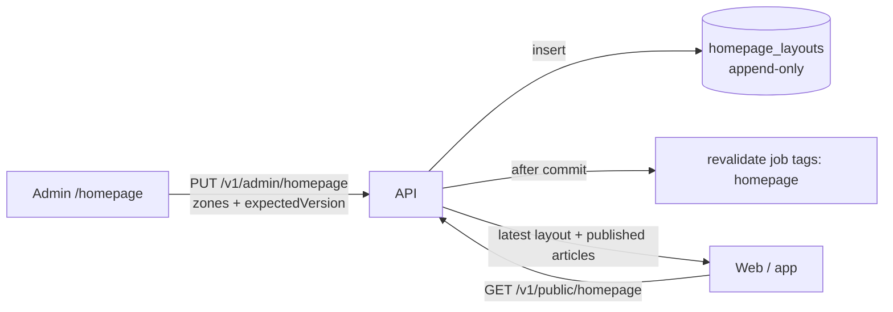

# Homepage layout

## Overview

**Built (API + admin editor).** Editors and admins choose what leads the homepage (PRD C2, §9.7):
- a **hero** article
- up to **4 featured** articles
- the **order of category sections**

Each save is a new, immediately live version, kept for revert. The public API serves the resolved homepage. The web page that renders it doesn't exist yet.

## How it works



### Storage
- `homepage_layouts(id, zones jsonb, created_by, timestamps)` holds one row per saved version. **The row with the highest id is live.**
- `zones` is `{ heroArticleId: id|null, featuredArticleIds: id[] (≤4), sectionCategoryIds: id[] (≤20, display order) }`, validated by `homepageZonesSchema`:
  - ids are unique
  - the hero cannot also be featured

### Admin API (editor, admin)

| Route | Does |
|---|---|
| `GET /v1/admin/homepage` | Live version (`version: null` before the first save), its zones, the pinned articles in any status (so the editor can flag unpublished ones), and the category names |
| `PUT /v1/admin/homepage` | `{ zones, expectedVersion }` → inserts a new version, audits it (`entity_type = homepage_layout`), then enqueues the `homepage` revalidation (`enqueueRevalidate(['homepage'])`) |
| `GET /v1/admin/homepage/versions` | Saved versions, newest first |

`PUT` rejects:
- `expectedVersion` not equal to the live version → 409 `EDIT_CONFLICT`. Saves are serialized with a transaction advisory lock, so two editors can't both pass the check.
- unknown or soft-deleted articles, or unknown categories → 400 `REFERENCE_NOT_FOUND`
- a pinned article that isn't `published` → 400 `ARTICLE_NOT_PUBLISHED`

### Public API

`GET /v1/public/homepage` (cache preset `news`) resolves the live layout for readers:

- **Pinned articles** that are no longer published are dropped.
- **Hero:** the pinned article, or the latest published one if there's none.
- **Featured:** filled up to 4 with the latest published articles, excluding the hero.
- **Sections:** each category in the editor's order with its latest 6 published articles, excluding what hero and featured already show.
- **Before the first save:** sections are the top-level categories ordered by `categories.sort_order`. A saved layout with no sections shows none.
- **`updatedAt`:** when the live layout was saved (null = defaults).

Code: `apps/api/src/modules/homepage/` (service, public.service, admin and public routes). It reuses `listPublishedArticles` (`modules/articles/public.service.ts`, which now also takes `categoryId`, `ids` and `excludeIds`).

### Admin editor

`apps/admin/src/pages/homepage/`:
- **Hero and featured:**
  - articles are picked in a dialog that searches **published** articles (`api.articles.list({status:'published'})`) and disables ones already on the page
  - featured order uses up/down buttons
- **Sections:**
  - **native HTML5 drag-and-drop** plus up/down buttons (keyboard and tests); no drag-and-drop library
  - add from the category lookup; remove
- **Save:**
  - "Хадгалж нийтлэх" (save and publish) sends `expectedVersion`
  - a 409 shows a banner, disables saving and offers a reload
  - a warning appears when a pinned article is no longer published, since the API refuses to save it
- **Versions sheet:** "Ачаалах" (load) puts an older version's zones into the editor, fetching labels for unknown articles. Saving makes it live again; that's how you revert.
- **Unsaved changes** are guarded with `FormLeaveGuard`.

## Tech used

Drizzle, shared Zod schemas (`schemas/homepage.ts`, `publicHomepageSchema`), BullMQ via `app.jobs.enqueueHomepageChanged()`, and in the admin React + TanStack Query + shadcn/ui.

## How to start

Log in as an editor and open http://localhost:5173/homepage. Then check the public endpoint:

```bash
curl -s localhost:4000/v1/public/homepage | jq '.data | {hero: .hero.title, featured: [.featured[].title], sections: [.sections[].category.nameMn]}'
```

## How to maintain

- **New zone** (e.g. an opinion rail):
  1. extend `homepageZonesSchema`, `adminHomepageSchema` and `publicHomepageSchema` (a contract change)
  2. resolve it in `getPublicHomepage`
  3. add a card to the editor
  4. extend `homepage.routes.test.ts` and `homepage-page.test.tsx`

  Old rows lack the new key, so give it a default when reading.
- **Revalidation** reaches the web only once `WEB_REVALIDATE_URL` points at a Next.js route ([web](../projects/web.md)).

## Notables

- There is no draft or preview: a save is live (an explicit editor action, which satisfies editorial invariant 3). A live preview (PRD §9.7) and scheduled layouts are follow-ups.
- No pin expiry or auto rules ("latest in section X") yet. Empty slots are always filled with the latest published articles.
- The breaking banner (PRD §6.2 `breaking_banner`) is not built.
- An article unpublished after being pinned simply disappears from the public homepage. The admin shows a warning until someone saves a layout without it.
- `homepage_layouts` grows by one row per save; there is no pruning.
- The web homepage that renders this layout is described in [public-site](public-site.md).

## Key files

`apps/api/src/modules/homepage/`, `apps/api/src/db/schema/homepage.ts`, `apps/api/drizzle/0007_homepage_layouts.sql`, `packages/shared/src/schemas/{homepage,public}.ts`, `apps/admin/src/pages/homepage/`.

---
Last updated: 2026-10-07 — revalidation tag renamed `homepage`; link to the web homepage. Earlier: versioned layouts, admin editor, public endpoint.
