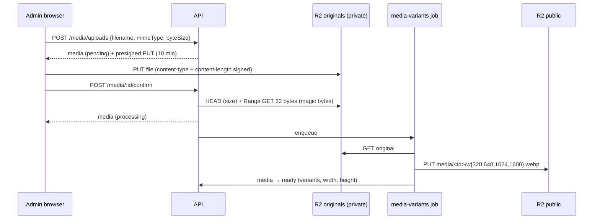

# Media

## Overview

**Built (API).** Images are uploaded by the browser straight to Cloudflare R2 with a presigned URL, verified by the API, then turned into WebP variants by a background job. A searchable media library manages alt text and credits. Article covers must be processed and credited.

## How it works



1. **Request upload** — allowed types `image/jpeg`, `image/png`, `image/webp`, `image/avif`; `byteSize` ≤ `MEDIA_MAX_BYTES` (15 MiB) else 400 `MEDIA_TOO_LARGE`. Creates a `pending` row with key `originals/YYYY/MM/<uuid>.<ext>` and returns `{ url, method: 'PUT', headers: { content-type }, expiresAt }`. `content-type` **and** `content-length` are part of the signature, so storage rejects a different file size or type.
2. **Upload** — the browser PUTs the file directly to the originals bucket.
3. **Confirm** (uploader, editor or admin) — if the object is not there yet the media stays `pending` (retry). Otherwise the size must equal the declared size and the first bytes must match the declared type; on failure the object is deleted, the row is `failed` and the API returns 400 `MEDIA_UPLOAD_INVALID`. On success the row becomes `processing` and the job is queued.
4. **Variants** — sharp decodes with a 100-megapixel limit, applies EXIF orientation, resizes to each width ≤ the original (one variant at the original width if it is narrower than 320), encodes WebP q80 and writes to the public bucket with `Cache-Control: public, max-age=31536000, immutable`. sharp writes no metadata, so **EXIF/GPS is stripped**. Undecodable files → `failed` immediately; storage errors retry (3 attempts) and then mark `failed`.

`variants` stores keys (`{ "w640": { key, width, height, bytes } }`); URLs are built from `MEDIA_PUBLIC_BASE_URL` at response time, so changing the media domain needs no data migration.

### Library and rules

- `GET /v1/admin/media?search=&status=&page=` (search on alt **or** credit), `GET /media/:id`, `PATCH /media/:id { alt, credit }` (audited). All newsroom roles can upload and browse.
- **Cover rule**: setting an article cover requires the media to be `ready` with non-empty alt and credit (400 `MEDIA_NOT_USABLE`). Alt/credit cannot be cleared while the media is a cover (409 `IN_USE`).
- Public DTOs expose only `ready` media; the original key never leaves the API.

### Storage

- **Two buckets**: originals (private — they keep camera EXIF including GPS) and public (WebP variants only). Startup refuses identical bucket names.
- `ObjectStorage` (`lib/storage.ts`) over aws4fetch: presign, head, ranged get, get, put, delete, ensureBucket, setCors. Path-style URLs work with R2 and SeaweedFS.
- **Local**: SeaweedFS in docker-compose (port 8333) with `docker/seaweedfs/s3.json`: a dev identity and anonymous read on `news-media-public` only. `pnpm storage:init` creates both buckets and sets CORS on originals for `CORS_ORIGINS`.

## Tech used

aws4fetch (SigV4 over fetch), sharp 0.35 (libvips; AVIF decode supported), BullMQ, SeaweedFS (`chrislusf/seaweedfs`) locally, Cloudflare R2 in production.

## How to start

```bash
docker compose up -d --wait
pnpm storage:init
pnpm dev
```

From code: `api.admin.media.uploadFile(file, { filename, alt, credit })` (presign → PUT → confirm), then poll `api.admin.media.get(id)` until `ready`. Manual: request an upload in Swagger, `curl -X PUT -H 'content-type: image/jpeg' --data-binary @photo.jpg "<url>"`, then confirm.

## How to maintain

- New allowed type: add it to `MEDIA_MIME_TYPES` (shared), a magic-byte check in `modules/media/validation.ts`, an extension in `MIME_EXTENSIONS`, and tests.
- New variant size: `MEDIA_VARIANT_WIDTHS` (shared); existing media need reprocessing (no route for that yet).
- Tests: `modules/media/media.routes.test.ts` (in-memory storage + fake jobs), `jobs/media-variants.test.ts` (real sharp: sizes, EXIF stripping, orientation, failures), `lib/storage.test.ts` (signature shape).

## Notables

- **MinIO is not used**: its Docker images are no longer published (`minio/minio` and `quay.io/minio/minio` have no manifest); SeaweedFS replaced it.
- aws4fetch does **not** sign `content-type`/`content-length` unless `allHeaders: true`, and defaults presigned expiry to 24 h unless `X-Amz-Expires` is already on the URL — both are set explicitly.
- HEIC (iPhone default) is not accepted: the prebuilt sharp cannot decode it. GIF is excluded (animation would be lost).
- R2 public buckets are bucket-wide public — never point `MEDIA_PUBLIC_BASE_URL` at the originals bucket.
- Follow-ups: delete/reprocess routes, cleanup of abandoned `pending` uploads and their objects, photo/logo rules for persons and organizations, admin upload UI, pinning the SeaweedFS image tag.

## Key files

`apps/api/src/modules/media/{admin.routes,service,validation}.ts`, `apps/api/src/jobs/processors/media-variants.ts`, `apps/api/src/lib/{storage,media}.ts`, `apps/api/src/plugins/storage.ts`, `apps/api/src/cli/storage-init.ts`, `packages/shared/src/schemas/media.ts`, `docker/seaweedfs/s3.json`.

---
Last updated: 2026-10-07 — initial version.
