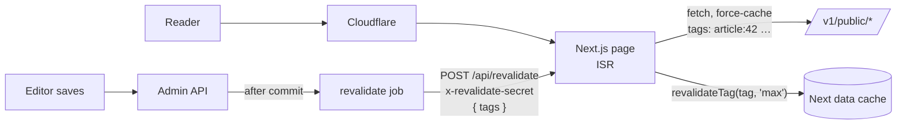

# Public site: homepage, article, person and section pages

## Overview

**Built.** The reader-facing pages of `apps/web`:

- `/`: the homepage
- `/news/{id}-{slug}`: an article
- `/person/{id}-{slug}`: a person profile
- `/section/{slug}` and `/section/{slug}/{n}`: a category's articles, paginated

They're server components that read the public API through the shared client and Next's data cache. Every fetch is tagged per entity, and the API's revalidate job refreshes those tags on publish and on data edits.

Every page has full SEO metadata (canonical, Open Graph, Twitter) and JSON-LD. Party, tag, bill and search pages are not built yet.

## How it works



### Pages

| Route | Content | Rendering |
|---|---|---|
| `/` | See the homepage rows below | ISR, `revalidate = 60` |
| `/news/{id}-{slug}` | Breadcrumbs, category and breaking labels, headline, lede, byline, published/updated time, `CorrectionNotice`, cover `<figure>` with credit, body, mentioned people (links), organizations, tags, then "Холбоотой мэдээ" (`RelatedArticles`: 4 compact cards from the same category, or the latest without one; hidden when empty) | On-demand ISR: `generateStaticParams() → []`, `revalidate = 300` |
| `/person/{id}-{slug}` | Photo or initial, current roles, `PartyBadge`, constituency, bio, recent articles (8, compact), current positions each with a `SourceLink` | On-demand ISR, `revalidate = 300` |
| `/section/{slug}` | `SectionHeader` (breadcrumbs, name), then `SectionArticles`: a lead card with 4 compact cards beside it, a grid of standard cards, `Pagination`. Empty section: `EmptyState` with a link home | On-demand ISR, `revalidate = 300` |
| `/section/{slug}/{n}` | Same header (page number as the last crumb) and a grid of 20 standard cards. `/section/{slug}/1` 308-redirects to `/section/{slug}`; past the last page is 404 | On-demand ISR, `revalidate = 300` |

**Homepage rows:**

- **Hero and featured:** from `GET /v1/public/homepage` ([homepage](homepage.md)), as a lead card plus compact cards.
- **"Шинэ мэдээ":** 10 of the latest articles, leaving out the ones already shown.
- **"Парламент энэ долоо хоногт":** bill stages and roll calls from the last 7 days, from `GET /v1/public/parliament/week`. Each tally is written out in numbers (the bar is decorative), and each item has a source link.
- **Category sections:** in the layout's order, each heading with a "Бүгдийг үзэх" link to its section page (named "{category}: бүх мэдээ" for screen readers). A section with no articles is hidden.

**URLs.** Both detail routes parse `{id}-{slug}` with `parseIdSlug` (`lib/routes.ts`). The id is canonical (PRD §7) and is in the cache tag. If the API returns a record with a different id, the page answers 404.

Section URLs have no id (PRD §7 `/section/[slug]`; categories are seed-only, so their slugs don't change). `parseSlug` and `parsePage` reject malformed segments (uppercase, `_`, `02`, above 10 000) with a 404 before any API request. Pages 2+ are a path segment, not `?page=`: reading `searchParams` would make the page dynamic (`Cache-Control: private, no-store`), so it couldn't be ISR or cached by the CDN.

**Loading and errors:**

- Only the homepage has a `loading.tsx` (`app/(home)/`, using `Skeleton`, which respects reduced motion). Article and person pages deliberately have none: a loading boundary above a page starts streaming with status 200 before the page can call `notFound()`, so a missing article would be a soft 404 (200 + `noindex`), cached by the CDN. Without it, bad URLs, missing records and unpublished articles answer a real **404**. Keep loading boundaries out of detail routes and out of the root `app/`, and put any `<Suspense>` below the `notFound()` check.
- The article's related rail is such a boundary: `<Suspense fallback={<RelatedArticlesSkeleton />}>` inside the page, after `load()`. It streams in after the article, and a missing article still answers 404 (verified with `next start`). If the related request fails, the rail is left out and the article renders anyway.
- Section page 1 streams its article list under the header: `<Suspense fallback={<SectionArticlesSkeleton />}>` after `loadCategory()`'s `notFound()`. List errors are not caught, so ISR keeps the last good page instead of caching an empty one. Pages 2+ render without a boundary: whether page n exists is only known from the list total, and a page past the end must answer a real 404 before anything streams.
- `error.tsx` has a retry button; `not-found.tsx` handles bad URLs, missing records and unpublished (410) articles.

### Data layer (`src/lib/data.ts`, server-only)

Every loader passes `{ cache: 'force-cache', next: { tags, revalidate } }` to the shared client's `init`.

| Loader | API | Tags | Revalidate |
|---|---|---|---|
| `getHomepage()` | `/homepage` | `homepage` | 300 s |
| `getLatestArticles(n)` | `/articles` | `homepage`, `articles` | 300 s |
| `getParliamentWeek()` | `/parliament/week` | `parliament`, `homepage` | 600 s |
| `getArticle(id, slug)` | `/articles/:slug` | `article:{id}` | 300 s |
| `getPerson(id, slug)` | `/persons/:slug` | `person:{id}`, `people` | 600 s |
| `getPersonArticles(id, slug, n)` | `/persons/:slug/articles` | `person:{id}`, `articles` | 300 s |
| `getRelatedArticles(article, n)` | `/articles?category=` | `articles` | 300 s |
| `getCategory(slug)` | `/categories/:slug` | `category:{slug}` | 3600 s |
| `getCategoryArticles(slug, page)` | `/categories/:slug/articles` (20 per page) | `category:{slug}`, `articles` | 300 s |

- API 404 and 410 become `notFound()`. On other API errors (API down, 5xx), pages already in the cache keep being served, and ISR retries on a later request. A page that has never been rendered answers Next's plain `500 Internal Server Error` (verified with the API stopped); `error.tsx` covers errors during client-side navigation.
- `duringBuildOr(load, fallback)`: during `next build` (`NEXT_PHASE=phase-production-build`), an unreachable API gives the homepage its "temporarily unavailable" state instead of failing the build. ISR replaces it within a minute. At runtime it calls `load` directly.
- Tag names are shared by `apps/api/src/lib/revalidate.ts` and `apps/web/src/lib/cache-tags.ts`. Keep them in sync.

### Revalidation (`src/app/api/revalidate/route.ts`)

`POST { "tags": ["article:42", "homepage"] }` with header `x-revalidate-secret`.

| Case | Response |
|---|---|
| `WEB_REVALIDATE_SECRET` not set | 503 `REVALIDATE_DISABLED` |
| Secret missing or wrong (constant-time comparison of SHA-256 digests) | 401 `UNAUTHORIZED` |
| Body not JSON, or not 1–50 tags matching `^[a-z][a-z0-9-]*(:[a-z0-9-]+)?$` | 400 `VALIDATION_ERROR` |
| OK | 200 `{ data: { revalidated: [...] } }` |

Each distinct tag gets `revalidateTag(tag, 'max')`. The cached entry is marked stale, so the next request still gets the old page while the new one renders in the background. Every response is `no-store`.

**What the API sends** ([jobs](jobs.md)):

| Change | Tags |
|---|---|
| Article publish, edit of a published article, unpublish | `article:{id}`, `homepage`, `articles` |
| Homepage layout saved | `homepage` |
| Person; their positions, statements, declarations | `person:{id}` |
| Promise (incl. status change) | `person:{id}`, or `people` for a party promise |
| Organization edit, position import | `people` |
| Bills, sponsors, stages, votes, vote import | `parliament` |
| Correction | the corrected record's tag (`article:{id}`, `person:{id}`, `parliament`, else `people`) |
| Category | nothing yet: categories are seed-only (no admin CRUD). `category:{slug}` is in both maps for when that exists; until then a renamed category shows within an hour |

### Article body and embeds

- The body is the API's sanitized `bodyHtml` (allowlist renderer plus sanitize-html), set with `dangerouslySetInnerHTML` inside `.article-body`. Typography for headings, lists, quotes, `figure.image`, `figure.pull-quote` and `.credit` is in `globals.css`.
- **Click-to-load embeds** (privacy and LCP; decided 2026-10-07):
  - `deferEmbeds` (`lib/article-html.ts`) replaces each `<figure class="embed embed-youtube|facebook"><iframe src=…>` with a `<button class="embed-load" data-embed-src=… data-embed-title=…>`. An iframe whose URL is not one of `EMBED_SRC_PREFIXES` (`@news/shared/content`) is removed.
  - Nothing from YouTube or Facebook loads before the tap.
  - `EmbedActivator` (a client component, added only when the body has embeds) listens for clicks, re-checks the allowlist and swaps the button for the iframe. YouTube gets `autoplay=1`.

### SEO (`src/lib/seo.ts`)

**Root metadata** (`layout.tsx`):

- `metadataBase` = `SITE_URL`
- title template `%s | <site name>`
- Open Graph `website`, `siteName`, `locale: mn_MN`
- Twitter `summary_large_image`
- `fb:app_id` when `FACEBOOK_APP_ID` is set

**Articles** (`articleMetadata`):

- canonical URL
- description from the lede, else the first 160 characters of the body text
- Open Graph `article` with `publishedTime`, `modifiedTime`, `section` and `tags`
- image: the largest cover variant up to 1600 px, with width, height and alt. Without a cover: the article's own share card (below)
- Twitter large card

**Persons** (`personMetadata`):

- description "role, party" (`personSummary`)
- Open Graph `profile`
- the photo when there is one

**Sections** (`sectionMetadata`):

- title: the category name, or "{category} — {n}-р хуудас" from page 2 (`section.pageTitle`)
- description from `section.description`
- canonical: every page to itself (PRD §11.3)
- Open Graph `website`, the section's share card (below), Twitter large card

**Share cards** (`lib/share-card.tsx`, `renderShareCard`): 1200×630 PNGs made with `next/og`.

- **Default:** `app/opengraph-image.tsx` (re-exported by `twitter-image.tsx`) shows the site name and tagline from `mn.json`. The homepage and profiles without a photo use it.
- **Article without a cover:** `app/news/[idSlug]/share-card/route.ts` shows the category, the headline (font size steps down with length, cut at a word past 120 characters) and the site name. It loads the article through `getArticle`, so it costs no extra API request, and answers 404 like the page.
  - Pages link to it as `/news/{id}-{slug}/share-card?v=<12 hex>` (`articleShareImage` in `seo.ts`). `v` is a SHA-256 of the title and category name, so a new headline gets a new image URL and Facebook's per-URL image cache can't show the old one.
  - Because the URL is versioned, the response is `public, max-age=86400, s-maxage=31536000, immutable`. The handler ignores `v`.
  - Not cached by Next (it shows as `ƒ` in the build). The CDN keeps it.
- **Section:** `app/section/[slug]/share-card/route.ts` shows the category name, the site tagline and the site name, at `/section/{slug}/share-card?v=<hash of the name>` (`categoryShareImage`). Same caching as the article card. The static `share-card` segment wins over the sibling `[page]`.

`ImageResponse` can't read woff2, so it uses a committed TTF subset of Source Serif 4 Bold (`src/assets/fonts/`, OFL; the rebuild steps are in that folder's README).

**JSON-LD** (`components/json-ld.tsx`; `serializeJsonLd` escapes `<`, `>`, `&`, U+2028 and U+2029):

| Page | Types |
|---|---|
| Home | `NewsMediaOrganization` (with corrections, ethics and ownership policy links) and `WebSite` |
| Article | `NewsArticle`: headline, images (cover or share card), dates, section, keywords, author, the full publisher node inline, `mentions` (Person with profile URL, Organization). `BreadcrumbList`: home → section (when the article has a category) → article |
| Section | `CollectionPage` (`isPartOf` the WebSite, publisher inline) whose `mainEntity` is an `ItemList` of the page's articles; positions continue across pages (page 2 starts at 21). `BreadcrumbList`: home → section (→ "n-р хуудас") |
| Person | `Person`: names, image, `jobTitle`, `affiliation` (party), `memberOf` (`OrganizationRole` with start date) |

### Config (`src/lib/env.ts`, Zod, read on first use)

| Var | Notes |
|---|---|
| `API_URL` | Required; API origin for server components |
| `SITE_URL` | Public origin for canonical, Open Graph and JSON-LD URLs. **Required in production**; `http://localhost:3000` otherwise |
| `WEB_REVALIDATE_SECRET` | ≥ 32 chars, the same value as the API's. Without it `/api/revalidate` answers 503 |
| `FACEBOOK_APP_ID` | Optional, digits only. Adds `<meta property="fb:app_id">` to every page (Sharing Debugger, share insights) |

## Tech used

- **Next.js 16** (App Router, classic data cache: `fetch` `next.tags`, `revalidateTag(tag, 'max')`, ISR, `next/og`)
- **next-intl 4**
- **Zod 4** (env and the revalidate body)
- `@news/shared` client, schemas and `EMBED_SRC_PREFIXES`

## How to start

```bash
pnpm -F @news/web dev     # http://localhost:3000; needs the API on API_URL
```

**Production-like run with revalidation:**

```bash
# terminal 1: the API, with the job pointed at the web
WEB_REVALIDATE_URL=http://localhost:3100/api/revalidate WEB_REVALIDATE_SECRET=<same 32+ chars> pnpm -F @news/api dev
# terminal 2
cd apps/web && pnpm build && SITE_URL=http://localhost:3100 WEB_REVALIDATE_SECRET=<same> pnpm start --port 3100
```

Then publish or edit something in the admin. The web log prints `Revalidated cache tags [...]`, and the next request after it shows the change.

**Tests:** `pnpm -F @news/web test`.

| File | Covers |
|---|---|
| `app/api/revalidate/route.test.ts` | Secret, body validation, `'max'` profile |
| `lib/data.test.ts` | Tags, `force-cache`, id mismatch, 404/410, build fallback |
| `lib/article-html.test.ts` | Embed transform against the real renderer output |
| `components/embed-activator.test.tsx` | Tap to load |
| `lib/seo.test.ts` | Metadata, JSON-LD, escaping |
| `lib/routes.test.ts` | `parseIdSlug` |
| `components/home/home.test.tsx` | Sections, parliament block, empty states |

## How to maintain

- **New page that reads the API:**
  1. Add a loader in `lib/data.ts` with tags.
  2. If a new tag is needed, add it to both `cacheTags` maps.
  3. Send it from the API route handlers that change that data (`revalidateAfterCommit`, after the service returns).
- **New embed provider:** also extend `EMBED_FIGURE` in `lib/article-html.ts` and the `article.embed` messages (see [articles](articles.md#how-to-maintain)).
- **New JSON-LD:** build it in `seo.ts` and render it with `<JsonLd>`. Never interpolate JSON into a script tag by hand.
- **Changing the share cards:** edit `lib/share-card.tsx` (both cards use it). If the text gains new characters, rebuild the font subset (`src/assets/fonts/README.md`). A design change doesn't change the article card's `v`, so the CDN keeps old cards for up to a year; add a version string to the hash input in `articleShareImage` if that matters.

## Notables

- **Facebook previews:** articles with a cover share a WebP variant. Facebook's WebP support is unreliable (community reports of Sharing Debugger errors), and PRD §11.4 asks for a JPEG of 1200×630. A JPEG share variant in the media pipeline is the next change (follow-ups). Cover-less articles already get a PNG headline card.
- The share card font is a subset (Latin + Mongolian Cyrillic). Characters outside it, such as emoji, render as blanks or are fetched by `next/og` at render time.
- An unpublished article returns the 404 page, not a 410 status: App Router pages can't set 410. The API still returns 410.
- Person URLs moved from `/person/{slug}` to `/person/{id}-{slug}` (PRD §7, id canonical) so the page knows its `person:{id}` tag before fetching. The URL table in PRD §7 still shows `/person/[slug]`.
- The organization JSON-LD and the footer link to `/corrections`, `/editorial-policy` and `/ownership`, which are not built yet (404 until then).
- The 404 for an unknown or unpublished URL also carries `s-maxage=300`, so Cloudflare may keep serving it for up to 5 minutes after the article is (re)published. Tag revalidation refreshes Next's cache, not the CDN's (CDN purge is a follow-up).
- **Revalidation is best effort:** enqueue failures are logged, never fail the edit. Time-based revalidation (60–600 s) is the fallback.
- The API's `Cache-Control` on `/v1/public/*` doesn't affect Next's data cache, which uses `force-cache` with tags.
- **Slug changes:** a request with an old slug and the right id reaches the API with the old slug and 404s. Redirects on slug change are a follow-up (see [articles](articles.md#notables)).
- Follow-ups:
  - **JPEG share variant for covers** (API `media-variants` job + `shareUrl` in `publicMediaSchema` + backfill), then `og:image` prefers it
  - `BreadcrumbList` on person pages
  - party, tag, bill and search pages (the tag page can reuse `SectionArticles`; the API's tag routes match the category ones)
  - RSS per section (PRD X2)
  - send `category:{slug}` from category CRUD once it exists
  - CSP (`frame-src https://www.youtube-nocookie.com https://www.facebook.com`)
  - a 410 response for unpublished articles (middleware)
  - sitemap and RSS
  - CDN purge alongside tag revalidation

## Key files

**Web** (`apps/web/src/`):

- pages: `app/(home)/{page,loading}.tsx`, `app/{layout,error,not-found,opengraph-image,twitter-image}.tsx`, `app/news/[idSlug]/` (with `share-card/route.ts`), `app/person/[idSlug]/`, `app/section/[slug]/` (`page.tsx`, `[page]/page.tsx`, `share-card/route.ts`, `section-shared.tsx`)
- revalidation: `app/api/revalidate/route.ts`
- data and SEO: `lib/{data,env,cache-tags,seo,site,routes,article-html}.ts`, `lib/share-card.tsx`
- components: `components/{article-body,embed-activator,json-ld,related-articles,section-articles,skeleton,empty-state,section-heading}.tsx`, `components/home/`
- font: `assets/fonts/`

**API:**

- `apps/api/src/lib/revalidate.ts`
- `apps/api/src/modules/legislation/public.{routes,service}.ts` (`/parliament/week`)

---
Last updated: 2026-10-08 — section pages (`/section/{slug}[/{n}]`, CollectionPage JSON-LD, section share card, `category:{slug}` tag) linked from article categories and homepage sections. Earlier the same day — article page: related rail with skeleton, per-article share card, `fb:app_id` (`FACEBOOK_APP_ID`), inline publisher and `BreadcrumbList` JSON-LD. Earlier: initial version (homepage, article and person pages, tag revalidation, SEO, JSON-LD, share card).
