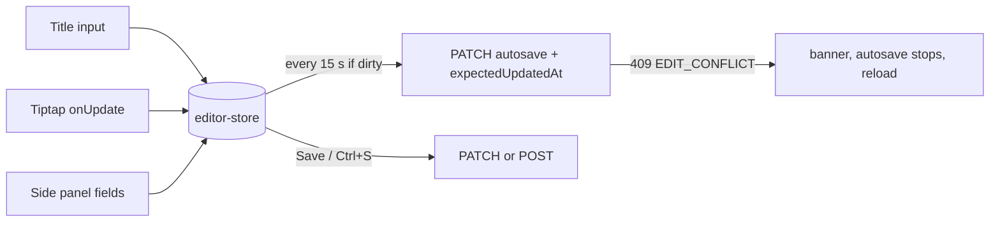

# Admin SPA (`apps/admin`)

## Overview

**Built.** The newsroom app has:

- login and cookie session handling (redirect on 401)
- a role-aware sidebar, Mongolian UI, toasts and one reusable DataTable
- list pages for Articles, Persons, Organizations, Bills, Promises, Corrections and Media
- the **article editor** (Tiptap) at `/articles/new` and `/articles/:id`
- **political data screens**:
  - persons: profile, positions timeline, linked-record tabs
  - bills: form, stages, sponsors, roll calls and the **vote-entry grid**
  - promises, with a status history
  - corrections
- the **homepage layout editor** at `/homepage`

Users shows a "not built yet" page (no API). Organizations have a list only (no edit screen yet).

## How it works

### Session

```mermaid
sequenceDiagram
  participant U as Browser
  participant A as Admin SPA
  participant API as API
  A->>API: GET /v1/admin/auth/me (cookie)
  alt 200
    API-->>A: user + csrfToken → session "authenticated"
  else 401
    API-->>A: → session "anonymous" → /login?next=…
  end
  U->>A: submit login
  A->>API: POST /v1/admin/auth/login
  API-->>A: Set-Cookie sid + {user, csrfToken}
  A->>API: list requests (cookie; X-CSRF-Token on writes)
  API-->>A: 401 SESSION_EXPIRED
  A-->>U: toast + /login?next=<page>
```

- `lib/session.ts` — tiny external store (`loading | authenticated | anonymous`, user, csrfToken, `endedBy`). The **CSRF token lives in memory only**; a reload restores it from `GET /me`.
- `lib/api.ts` — the shared client with `credentials: 'include'` and `getCsrfToken` from the store, so every non-GET call sends `X-CSRF-Token`.
- `auth/AuthProvider.tsx` — restores the session on load, exposes `login()` / `logout()`.
- `lib/query-client.ts` — `QueryCache`/`MutationCache` `onError`: any API **401** ends the session (toast if the user was signed in) and clears the cache; `RequireAuth` then redirects to `/login?next=<current page>`. 4xx responses are never retried; network/5xx are retried once.
- `?next=` is only honoured for same-app paths (`safeNext` in `navigation.ts`): no `//host`, no absolute URLs.

### Routing and roles

`router.tsx` exports `routes` (used by `createBrowserRouter` in `main.tsx` and by memory routers in tests):

- `/login` — `LoginPage` (redirects away if already signed in).
- `/` — `RequireAuth` → `AppLayout` (sidebar + header) → sections, each wrapped in `RequireSection` (403 page for other roles); `/` redirects to the role's first section; unknown paths → 404 page.

`navigation.ts` is the single source of truth for the menu **and** the guards:

| Section | Roles | Source |
|---|---|---|
| Articles | reporter, editor, admin | API `requireRole` |
| Persons, Organizations, Bills, Promises, Corrections | data_editor, admin | API |
| Media | reporter, editor, admin, data_editor | API |
| Homepage | editor, admin | API |
| Users | admin | PRD (no API yet) |

Hidden items are never rendered; the API enforces the same rules independently.

### DataTable

`components/data-table/`:

- `DataTable` — `@tanstack/react-table` with `manualPagination` (the API paginates). Props: `columns`, `rows`, `pagination`, `isLoading`, `isFetching`, `error`, `onRetry`, `list`, `searchPlaceholder`, `filters` (`select` with options, or `toggle`). Renders skeleton rows, an error alert with retry, an empty state, a "refreshing" hint, and a pagination bar (previous/next, page X of Y, total, page size 20/50/100).
- `useListParams(filterKeys)` — page, pageSize, search and filters live in the **URL** (shareable, back button works). Search is debounced 300 ms; changing search or a filter resets to page 1.
- `useListQuery(key, params, fetcher)` — TanStack Query with `keepPreviousData` so rows stay visible while the next page loads.
- List pages validate URL filter values with the shared enum schemas (e.g. `articleStatusSchema.safeParse`) before calling the API, so a tampered URL never reaches it.

### Article editor

`pages/article-editor/` (page, side panel, saving) and `editor/` (Tiptap). Route `articles/:id`, where `new` creates.



- **State** (`editor-store.ts`): one tiny external store per mounted editor holds `article` (last server state), `values` (the form) and `version`/`savedVersion`. "Dirty" means `version !== savedVersion`. A save remembers the version it sent, so edits typed during a save stay dirty. Saves, timers and the navigation blocker read `store.get()`, so they never see stale values.
- **Saving** (`use-article-save.ts`):
  - The body is built and checked with `contentDocSchema` first (same as the API).
  - Every update sends `expectedUpdatedAt`; 409 `EDIT_CONFLICT` shows a banner, makes the form read-only and stops autosave until "Дахин ачаалах" (reload).
  - Published articles ask minor/substantive first (`edit-type-dialog.tsx`).
  - Saves go through `useMutation`, so a 401 ends the session like everywhere else.
- **Autosave:** every 15 s (`AUTOSAVE_INTERVAL_MS`), only for an existing article in draft/in_review that the user may edit. A new article is created by the first manual save; the form is frozen during that request, then the URL is replaced with `/articles/:id`.
- **Remounts:** the page (`article-editor-page.tsx`) keys the editor by `id` plus a generation counter. Restore and reload put the server article in the query cache and bump the generation, so Tiptap starts from the new document.
- **Workflow card** (`workflow-card.tsx`): status plus the buttons `can()` and `canTransition()` allow, from `@news/shared/policies`, the same code the API enforces.
  - Unsaved changes are saved before a transition; for published articles the user must save first.
  - Schedule uses a native `datetime-local` read as **Ulaanbaatar time** (`lib/timezone.ts`, Intl-based) and refuses past times.
- **Metadata panel:** category, lede, breaking, cover (`cover-field.tsx` + media picker; alt and credit required), and tags / persons / organizations / bills (`components/lookup-multi-select.tsx`: chips with photos, cmdk search against `/v1/admin/lookup/*`, `ids=` hydration). Editors and admins can create a tag from the search text.
- **Revision history** (`revision-history.tsx`, a sheet):
  - Lists revisions; the selected one is diffed **against the current editor state** (`revision-diff.ts`).
  - Word diffs of title, lede and body text use jsdiff with `Intl.Segmenter`; the default tokenizer splits Cyrillic into letters.
  - Changed fields and links are shown by name.
  - Restore asks for confirmation (warning about unsaved changes) and the edit type when published.
- **Leaving:** `unsaved-changes-guard.tsx` uses `useBlocker` (needs the data router) for in-app navigation and `beforeunload` for tab close and reload.
- **Read-only:** when `can(user, 'update', article)` is false (e.g. a reporter after submitting), a banner explains it and everything is disabled.

**Tiptap** (`editor/`):

- `extensions.ts`: StarterKit (no code block, h2–h4, Link restricted to http/https/mailto, opens in a new tab) plus the three custom nodes and a placeholder.
- `media-image.tsx`: Image + `mediaId`/`caption`/`credit`, with a node view whose caption and credit inputs live in the document. Pasted images are accepted only with an https `src`.
- `embed.tsx`: atom node `{provider, url}` with a live, non-interactive iframe preview; inserted via `embed-dialog.tsx` (`parseEmbedUrl`).
- `pull-quote.tsx`: inline content plus an attribution input.
- `toolbar.tsx` (`useEditorState`), `link-dialog.tsx`, and `components/media-picker-dialog.tsx`.
- The media picker is shared by inline images and the cover: search, upload (presigned, then polls until `ready`), and alt/credit fixed in place (PATCH media) before choosing.

### Political data screens

Routes are `persons/:id`, `bills/:id`, `bills/:id/votes`, `promises/:id` and `corrections`; `new` creates. Each list page links rows to the detail page and has a "new" button.

**Patterns shared by these screens** (reuse them for new ones):
- **Page-level forms** (person profile, bill, promise, vote grid, homepage):
  - `lib/form-store.ts` (`createFormStore`, the same version/savedVersion idea as the article editor) plus `components/form-leave-guard.tsx`, which blocks in-app navigation and tab close while dirty
  - the save remembers the version it sent, so edits made during a save stay dirty
  - after creating, the URL is replaced with the new id
- **Sub-records** (positions, statements, declarations, stages, corrections, status changes):
  - `components/form-dialog.tsx`, mounted only while editing, so each open starts fresh
  - `hooks/use-save-record.ts` runs the mutation, invalidates queries, shows a toast and maps `VALIDATION_ERROR` details to field errors
  - before sending, the same shared Zod create schema runs (`schemaFieldErrors`); messages come from `mn.json` (`form.invalid`)
- **Other building blocks:**
  - `components/form-field.tsx` (label/hint/error)
  - `components/lookup-select.tsx` (single entity picker; `lookup-multi-select.tsx` is the multi version)
  - `components/timeline.tsx` (dated vertical list)
  - `components/delete-button.tsx` (icon + confirm), `components/media-field.tsx` (cover/portrait with alt + credit required)
  - shadcn `tabs`
  - `DataTable` can hide its search box (`searchable={false}`) for endpoints without `search`
- **Delete buttons** are rendered only for roles the API allows (positions, stages, statements, declarations and corrections: admin; persons: soft delete for data_editor and admin).
- **Inside `DataTable` cells**, keep dialog state at page level. Cells remount when the column defs change. `useLookupItems` returns a memoized `Map` so columns that depend on it stay stable.

**Persons** (`pages/persons/`):
- **Profile form.** The slug is read-only, because slug changes need redirects, which don't exist yet.
- **Positions timeline:**
  - organization names come from lookup hydration
  - add or edit in a dialog, plus "end position"
  - delete is admin-only
- **Tabs:**
  - Statements and Declarations: CRUD dialogs
  - Promises: links to the promise page and "new promise" with `?personId=`
  - Votes: read-only
  - Corrections: `entityType=person`

  MNT amounts are formatted from the decimal string (`formatMnt`), so 16-digit values keep every digit.

**Bills** (`pages/bills/`):
- **Form.** The status is set here; stages record the dated history.
- **Stages timeline.**
- **Sponsors**, edited locally and saved as one list (`PUT /bills/:id/sponsors`).
- **Roll calls table** (`vote-sessions`).
- **Vote grid** (`vote-grid-page.tsx`):
  - choose a date and motion (with suggestions), then the roster loads all MPs serving that day
  - recorded votes are pre-filled; people out of office are labelled
  - **one required source URL** for the whole roll call, pre-filled with the most common existing one
  - a name/party filter, live counts, and "fill the rest as absent"
  - **save** runs the votes import as a **dry run** first (a confirmation with "N new, M changed, K unchanged"), then commits
  - recorded votes can be changed but not removed (the import never deletes)
  - changing the session is disabled while there are unsaved changes

**Promises** (`pages/promises/`):
- The form covers subject (person or organization), text, date, source and an evidence links list. It never sends `status`.
- The status card's **"Төлөв өөрчлөх"** (change status) dialog requires a note and an evidence URL, and posts to `/promises/:id/status`.
- The history timeline comes from `/promises/:id/updates`.

**Corrections** (`pages/corrections/`):
- A list filtered by entity type. Targets are labelled via lookup for persons, organizations and bills, or `#id` otherwise.
- A create/edit dialog with a lookup or a numeric id per type.
- Delete is admin-only.
- Article corrections still come from the published-edit flow.

### Homepage editor

`pages/homepage/`: hero, 4 featured slots and category sections. Sections reorder with **native HTML5 drag-and-drop plus up/down buttons**. Saves send `expectedVersion` and get a conflict banner on 409; a versions sheet loads an older layout so it can be saved again. Details are in [homepage](../features/homepage.md).

### UI

- **shadcn/ui** (Radix base, "nova" preset) components are copied into `src/components/ui/` and owned by this repo. Toasts: shadcn's sonner (`lib/notify.ts`: `notify.success/info/error/apiError`). Icons: lucide-react.
- All text comes from `src/locales/mn.json` (including screen-reader labels inside shadcn components). API errors map to `errors.<CODE>`.
- Dates via `Intl` `mn-MN`, `Asia/Ulaanbaatar` (`lib/format.ts`). Fonts: system stack (covers Ө ө Ү ү), no webfont.

## Tech used

React 19, Vite 8, Tailwind CSS 4 (`@tailwindcss/vite`), shadcn/ui (radix-ui, class-variance-authority, `cn`, tw-animate-css, cmdk for `command`, the `shadcn` package for its Tailwind CSS import), sonner, lucide-react, TanStack Query 5, TanStack Table 8, React Router 8, i18next, Tiptap 3 (`@tiptap/react`, `@tiptap/pm`, `@tiptap/starter-kit`, `@tiptap/extension-image`, `@tiptap/extensions`), jsdiff (`diff` 9), `@news/shared`. Tests: Vitest + Testing Library + jsdom.

## How to start

```bash
pnpm -F @news/admin dev     # http://localhost:5173 (VITE_API_URL in apps/admin/.env)
pnpm -F @news/admin test
pnpm -F @news/admin build
```

Log in with an account created by `pnpm admin:create` (seeded users have no passwords). The API must list `http://localhost:5173` in `CORS_ORIGINS`.

## How to maintain

- **New list page**: define columns with `createColumnHelper<Dto>()`, call `useListParams([...filterKeys])` + `useListQuery(key, params, fetcher)`, validate filter values with the shared enum schemas, render `<DataTable>`. Add the route in `router.tsx` wrapped in `RequireSection`, the section in `navigation.ts` (with roles matching the API), strings in `mn.json`, and a test.
- **New shadcn component**: `pnpm dlx shadcn@<version> add <name> -c apps/admin` (pin a version that is at least a day old — pnpm release-age guard). Then route any English text through i18n and run `pnpm lint`.
- **New editor node**: add it to the shared allowlist and renderer and to the API sanitizer first ([articles](../features/articles.md#how-to-maintain)). Then:
  1. write a Tiptap `Node` in `src/editor/` whose JSON matches the shared schema exactly (names and attributes), with a React node view if it needs inputs
  2. add it to `articleExtensions()`, a toolbar button and its strings
  3. extend `editor/extensions.test.ts`, which round-trips the editor's JSON through `contentDocSchema` and `renderHtml`

  Anything the editor can produce but the allowlist rejects makes every save fail.
- **New political-data screen**: copy the persons or bills folder pattern (page component → form with `createFormStore` + `FormLeaveGuard` → sections with `FormDialog` + `useSaveRecord`). Add the route in `router.tsx` (with `RequireSection`), the section in `navigation.ts` if it is new, enum labels under `status.*` (`i18n.test.ts` checks them) and a page test with `mockApi`.
- **New string**: add to `mn.json` only; `i18n.test.ts` checks error codes, statuses, roles and sections.
- **Tests** (`src/**/*.test.ts(x)`): `renderApp(path)` renders the whole app on a memory router; `mockApi({ 'GET /v1/…': handler })` stubs fetch; fixtures in `src/test/fixtures.ts`. jsdom polyfills (matchMedia, ResizeObserver, pointer capture, and Range rects / `elementFromPoint` for ProseMirror) are in `src/test/setup.ts`.
  - Editor tests (`article-editor-page.test.tsx`) cover loading, autosave timing with fake `setInterval`, 409 handling, create, edit type, the workflow buttons per role and status, scheduling in UB time, the cover rule, lookups, the leave guard, and diff/restore.
  - Typing *into* ProseMirror is not simulated in jsdom; the body is covered by `editor/extensions.test.ts` instead.

## Notables

- The shadcn CLI added Geist (`@fontsource-variable/geist`) and `next-themes`; both were removed. Geist was replaced by system fonts to guarantee Mongolian Cyrillic; `next-themes` was only used by the sonner wrapper (theme fixed to light).
- shadcn's `use-mobile` hook set state inside an effect (fails `react-hooks/set-state-in-effect`); it was rewritten with `useSyncExternalStore`.
- TypeScript 6 deprecates `baseUrl`; the `@/*` alias uses `paths` only.
- TanStack Table is on **v8** (v9 exists) because shadcn's data-table pattern targets v8's API.
- The production bundle is ~1.43 MB (~430 KB gzip) in one chunk (Tiptap/ProseMirror plus the data screens) (Vite warns about chunks over 500 KB). That's acceptable for an internal tool. Lazy-loading the editor route (`React.lazy` for `ArticleEditorPage`) is the obvious first split.
- `SameSite=Strict` cookies work because `localhost:5173` and `localhost:4000` are the same site. Safari needs `SESSION_COOKIE_SECURE=false` on http://localhost.
- The editor's live embed previews load YouTube and Facebook iframes inside the admin.
- After restore or reload, Tiptap's undo history starts fresh (the editor remounts).
- Clicking into a document that ends with an image or embed can mark it dirty: StarterKit's trailing-node plugin appends an empty paragraph. That is harmless (the next autosave stores it).
- **Not verified in a real browser:** the editor was exercised with jsdom tests and API calls only. Drag-and-drop of node views, paste handling and iframe previews still need a manual click-through.
- Political-data screens and the homepage editor are covered by jsdom tests only, not a browser click-through. Native drag-and-drop in particular is tested with synthetic events.
- Follow-ups: organization edit screen, person restore (no API), media library upload UI on `/media`, Users screen (API first), TOTP, per-route code splitting.

## Key files

`src/main.tsx`, `src/router.tsx`, `src/app-providers.tsx`, `src/navigation.ts`, `src/auth/{AuthProvider,guards}.tsx`, `src/lib/{api,session,query-client,notify,format,timezone,media}.ts`, `src/editor/`, `src/pages/article-editor/`, `src/components/{media-picker-dialog,media-field,lookup-multi-select,lookup-select,confirm-dialog,delete-button,form-dialog,form-field,form-leave-guard,timeline}.tsx`, `src/hooks/{use-lookup,use-debounced-value,use-save-record}.ts`, `src/lib/{form-store,form-errors,dates}.ts`, `src/pages/{persons,bills,promises,corrections,homepage}/`, `src/components/data-table/`, `src/components/layout/`, `src/components/ui/`, `src/pages/`, `src/locales/mn.json`, `src/test/`, `components.json`, `vite.config.ts`, `vitest.config.ts`.

---
Last updated: 2026-10-07 — political data screens (persons, bills + vote grid, promises, corrections), homepage editor, form building blocks.
