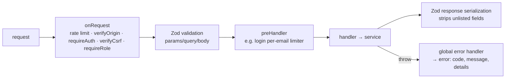

# API (`apps/api`)

## Overview

**Built.** Fastify 5 + TypeScript API serving the public site and app (`/v1/public/*`, no auth, CDN-cacheable) and the newsroom (`/v1/admin/*`, session + CSRF). Also hosts the BullMQ workers and the operational CLIs. Feature details live in the [feature pages](../README.md#features); this page covers the structure shared by all of them.

## How it works

### App assembly (`src/app.ts` → `buildApp(env, options)`)

`buildApp` builds the app without listening (used by `server.ts` and by tests through `inject()`). In order:

1. `app.env` decoration, Zod validator/serializer compilers (`fastify-type-provider-zod`), global error + 404 handlers.
2. Plugins: `db` (Drizzle/postgres.js) → `redis` (ioredis, fail-fast) → `security` (helmet, CORS, global rate limit on Redis) → `auth` (cookies, `request.user`, `requireAuth`/`requireRole`/`verifyOrigin`/`verifyCsrf`) → `jobs` (`app.jobs`) → `storage` (`app.storage`) → `swagger` (development only, UI at `/docs`).
3. Routes:
   - `/health`, `/health/ready` (unversioned, not rate-limited).
   - `/v1/public` scope — `onSend` hook adds `Cache-Control` (see [public-api](../features/public-api.md)). Modules: articles, taxonomy, homepage, people, legislation.
   - `/v1/admin` scope — `onRequest: verifyOrigin`; auth routes (login is public); then a **protected sub-scope** with `onRequest: requireAuth, verifyCsrf` and `Cache-Control: no-store`. Modules: articles, people, legislation, records, corrections, media, lookup, taxonomy, homepage.

`server.ts` loads env, builds the app, starts the BullMQ workers when `WORKERS_ENABLED`, and listens.

### Request lifecycle



Auth and role checks run in **`onRequest`**, before validation, so unauthorised callers get 401/403 and never learn the request schema from a 400.

### Module layout

`src/modules/<domain>/`: `admin.routes.ts`, `public.routes.ts`, `service.ts` (business logic + DB), `index.ts` (registers the plugin), plus extras (`import.ts`, `policy.ts`, `validation.ts`, `public.service.ts`). Domains: `auth`, `articles`, `people`, `legislation` (incl. `vote-entry.ts`: vote roster and sessions), `records` (incl. the promise status endpoint), `corrections`, `media`, `taxonomy` (public reads + admin tag creation), `lookup` (admin-only picker search for the article editor), `homepage` (layout versions, admin + public), `health`.

### Conventions (enforced across modules)

- **Responses**: `{ data }` or `{ data, pagination: { page, pageSize, total, totalPages } }`; errors always `{ error: { code, message, details? } }` via `AppError(status, code, message, details?)`.
- **Constraint errors** are mapped centrally (`lib/db-errors.ts`): FK on write → 400 `REFERENCE_NOT_FOUND`; FK/RESTRICT on delete → 409 `IN_USE`; unique → 409 `DUPLICATE`; CHECK/NOT NULL → 400 `VALIDATION_ERROR`.
- **Audit**: every admin mutation writes `audit_log` in the same transaction (`lib/audit.ts`, `diffOf()` from `lib/crud.ts`). Articles additionally keep `article_revisions`.
- **Jobs** are enqueued through `app.jobs` after commit; failures to enqueue are logged, not thrown.
- **Shared helpers** (`src/lib/`): `crud.ts` (paginate, notFound, diffOf, definedOnly, likePattern, assertHasChanges), `slugs.ts`, `routes.ts` (error-response maps, `currentUser`), `cache.ts`, `media.ts`, `html.ts`, `password.ts`, `imports.ts`, `storage.ts`.

## Tech used

| Package | Why |
|---|---|
| fastify 5, fastify-plugin | HTTP server, encapsulated scopes |
| fastify-type-provider-zod 7 + zod 4 | Validation, serialization, OpenAPI from shared schemas |
| @fastify/swagger, @fastify/swagger-ui | OpenAPI + `/docs` (dev only) |
| @fastify/helmet, @fastify/cors, @fastify/rate-limit, @fastify/cookie | Security headers, CORS with credentials, Redis-backed rate limits, cookies |
| drizzle-orm 0.45 + postgres (postgres.js), drizzle-kit 0.31 | DB access with `casing: 'snake_case'`, migrations |
| ioredis | Rate-limit store, readiness check, BullMQ connections |
| bullmq 6 | Background jobs ([jobs](../features/jobs.md)) |
| @node-rs/argon2 | Password hashing (prebuilt, no install script) |
| sanitize-html | Article HTML allowlist |
| aws4fetch, sharp | R2/S3 presigning + requests; image variants ([media](../features/media.md)) |
| pino (+ pino-pretty in dev) | Logging; auth headers/cookies redacted |
| tsx, tsdown, vitest 5 | Dev runner, production bundle (bundles `@news/shared` source), tests |

## How to start

```bash
pnpm -F @news/api dev        # tsx watch, reads apps/api/.env
pnpm -F @news/api test       # needs docker compose running
pnpm -F @news/api build && pnpm -F @news/api start
```

### Environment variables (`src/config/env.ts`)

| Variable | Default | Required / notes |
|---|---|---|
| `NODE_ENV` | `development` | `development` \| `test` \| `production` |
| `HOST` | `0.0.0.0` | |
| `PORT` | `4000` | |
| `LOG_LEVEL` | `info` | pino level; `silent` in tests |
| `DATABASE_URL` | — | **Required.** `postgres://…` (local: port 5433) |
| `REDIS_URL` | — | **Required.** `redis://…` |
| `CORS_ORIGINS` | empty | Comma list of browser origins (admin, web). Also the allowlist for the admin Origin check |
| `TRUST_PROXY` | `false` | `true` behind Cloudflare so `request.ip`/protocol/host come from forwarded headers |
| `AUTH_SECRET` | — | **Required**, ≥ 32 chars. HMAC key for CSRF tokens |
| `SESSION_COOKIE_SECURE` | `true` | Must be `true` in production (enforced); `false` only for Safari on http://localhost |
| `RATE_LIMIT_MAX` | `300` | Global per-IP requests per window |
| `RATE_LIMIT_WINDOW` | `1 minute` | |
| `WORKERS_ENABLED` | `true` | Run BullMQ workers in this process |
| `WEB_REVALIDATE_URL` | — | The web's `/api/revalidate` (e.g. `http://localhost:3000/api/revalidate`). Optional; revalidate jobs skip when unset |
| `WEB_REVALIDATE_SECRET` | — | ≥ 32 chars; required when `WEB_REVALIDATE_URL` is set. Must equal the web's `WEB_REVALIDATE_SECRET` |
| `MEDIA_PUBLIC_BASE_URL` | — | Public bucket base URL; media URLs are `null` without it. Required in production |
| `S3_ENDPOINT` | — | R2: `https://<account>.r2.cloudflarestorage.com`; local: `http://localhost:8333` |
| `S3_ACCESS_KEY_ID`, `S3_SECRET_ACCESS_KEY` | — | Storage credentials |
| `S3_REGION` | `auto` | |
| `MEDIA_ORIGINALS_BUCKET` | — | Private bucket (originals keep EXIF/GPS) |
| `MEDIA_PUBLIC_BUCKET` | — | Public bucket (WebP variants); must differ from originals (enforced) |
| `MEDIA_MAX_BYTES` | `15728640` | Max upload size (15 MiB) |

Storage variables are all-or-nothing outside production (media routes return 503 when absent) and all required in production.

## How to maintain

- **New domain module**: create `src/modules/<domain>/` with the files above; register its admin plugin inside the protected scope and its public plugin inside the public scope in `app.ts`. Use `onRequest: app.requireRole(...)` per admin route, `schema.security: csrfSecurity` on non-GET admin routes, `config: { cache: 'news' | 'profile' }` on public routes, response schemas for every status.
- **New env var**: add to `env.ts` (with refine if it depends on others), `.env.example`, the test env if tests need it, and the table above.
- **Tests**: Vitest files next to code (`*.test.ts`). Helpers in `src/test/`:
  - `buildTestApp(options)` — app against `news_test` with **fake jobs** and **in-memory storage** by default.
  - `signIn(app, role)` — user + session without going through login (no argon2, no rate limit).
  - `createFakeJobs()`, `createMemoryStorage()`, `createTestUser()`, `insertArticle()`, `seedRefs()` + `RESOURCES` (political-data specs), `makeJpeg()/makePng()`, `resetDb()`.
  - `globalSetup` refuses non-`_test` databases and runs migrations; files run sequentially.

## Notables

- **Hook phase matters**: anything that authenticates or authorises must be an `onRequest` hook. A `preHandler` runs after body validation and leaks schema errors to unauthorised callers (this bug existed until 2026-10-07).
- `@fastify/rate-limit` runs only **one** of its own handlers per request; a second limiter on the same route must use `app.createRateLimit()` (see [auth](../features/auth.md)).
- Fastify passes a **missing body as `null`**; optional bodies use `.nullish()` schemas.
- `ON DELETE RESTRICT` raises Postgres **23001**, not 23503 — both are mapped to `IN_USE`.
- Health endpoints are outside `/v1` and exempt from rate limiting so probes always work.
- The API process is one Node process; sharp work runs with concurrency 1 to keep requests responsive.

## Key files

`src/app.ts`, `src/server.ts`, `src/config/env.ts`, `src/plugins/*.ts`, `src/lib/*.ts`, `src/modules/*/`, `src/jobs/`, `src/db/`, `src/cli/`, `src/test/`, `vitest.config.ts`, `tsdown.config.ts`, `drizzle.config.ts`.

---
Last updated: 2026-10-07 — `homepage` module, promise status endpoint, vote roster/sessions; earlier: `lookup`, tag creation, iframe allowlist.
